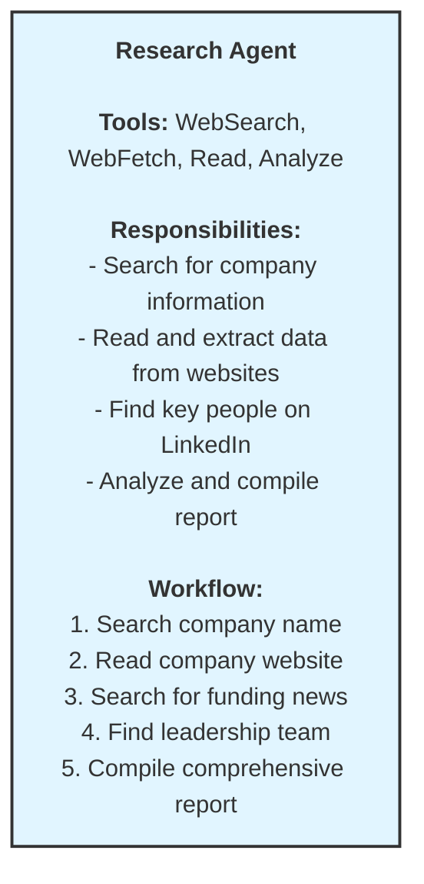
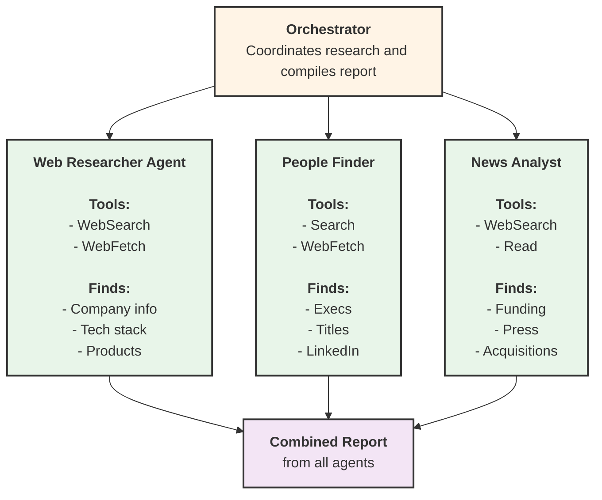
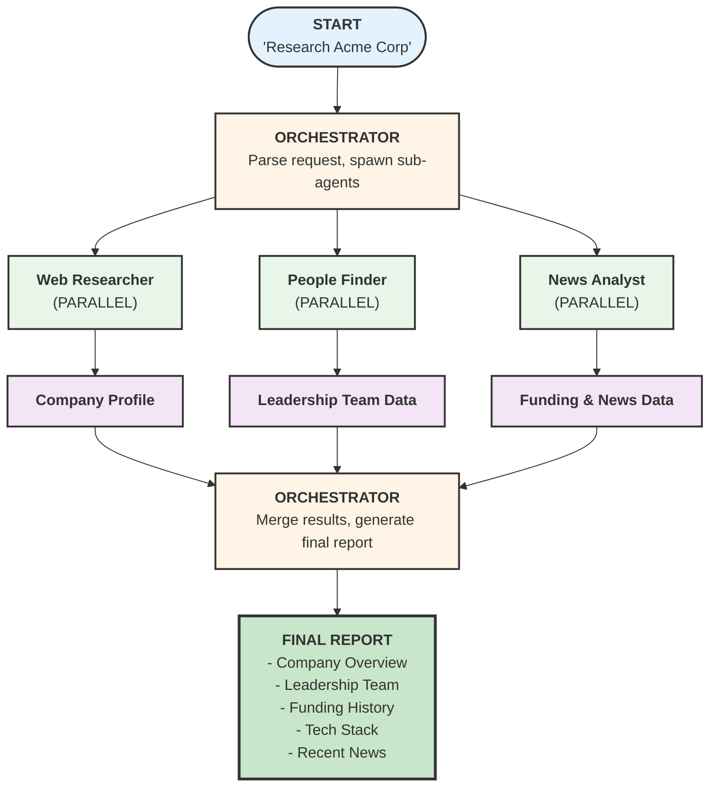
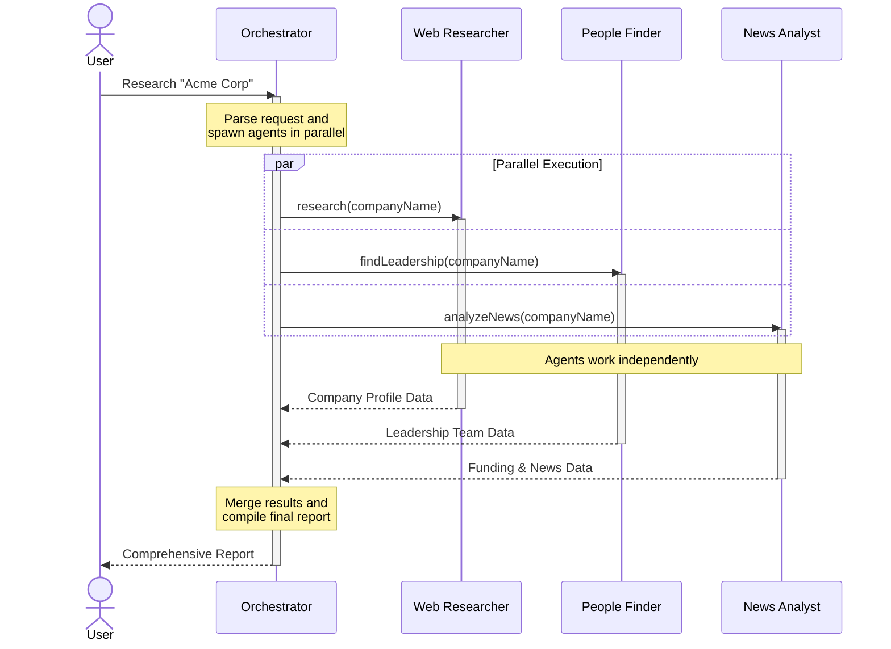

# Company Research Agent Architecture

A multi-agent system for automating comprehensive company research.

## Problem Statement

The sales team needs to research potential customers before outreach. Currently, research is manual:
- Search company website, news, LinkedIn
- Find key decision makers
- Identify company size, funding, tech stack
- Takes 2-3 hours per company

**Goal**: Automate this into a 5-minute agent-powered process.

---

## Non-Agentic vs Agentic Approach

### Non-Agentic (Traditional)
```
User → "Research Acme Corp" → Claude → Single Response → Done

Problems:
- Can only use information in the prompt
- No ability to search for additional data
- Can't verify or cross-reference information
- Single-shot response may miss important details
```

### Agentic (Autonomous)
```
User → "Research Acme Corp" → Agent → WebSearch → Agent evaluates
                                     → Read website → Agent evaluates
                                     → Search LinkedIn → Agent evaluates
                                     → Cross-reference → Final Report

Benefits:
- Agent autonomously gathers information
- Iterates until comprehensive
- Verifies data across sources
- Follows interesting leads
```

---

## Architecture Options

### Option A: Single Agent



**Pros:**
- Simple to implement
- No coordination overhead
- Single context window

**Cons:**
- Can't parallelize searches
- One agent doing everything
- Long sequential workflow

---

### Option B: Multi-Agent (Recommended)



**Pros:**
- Parallel execution (faster)
- Specialized agents (better quality)
- Clear separation of concerns
- Easy to add new research areas

**Cons:**
- More complex coordination
- Multiple API calls
- Need to merge results

---

## Recommended Architecture: Multi-Agent

### Agent Definitions

| Agent | Responsibility | Tools | Model |
|-------|---------------|-------|-------|
| Orchestrator | Coordinates agents, compiles report | Task | Sonnet |
| Web Researcher | Company website, products, tech | WebSearch, WebFetch | Haiku |
| People Finder | Leadership, org structure | WebSearch, WebFetch | Haiku |
| News Analyst | Funding, press, acquisitions | WebSearch, Read | Sonnet |

### Workflow Diagram



### Sequence Diagram

The following sequence diagram shows the interaction timeline between components:



---

## Orchestration Pattern: Parallel with Merge

```typescript
// Orchestrator spawns all research agents in parallel
const results = await Promise.all([
  webResearcher.research(companyName),
  peopleFinder.findLeadership(companyName),
  newsAnalyst.analyzeNews(companyName)
]);

// Orchestrator merges results
const report = await orchestrator.compileReport(results);
```

This pattern is ideal when:
- Sub-tasks are independent
- Speed matters
- Results can be merged at the end

---

## Key Takeaways

1. **Agentic = Autonomy + Tools + Iteration**
   - Agents can search, read, and iterate until satisfied
   - Not just single-shot responses

2. **Single Agent for Simple Tasks**
   - When workflow is linear
   - When parallelization isn't needed

3. **Multi-Agent for Complex Tasks**
   - When you need speed (parallel execution)
   - When tasks need specialized expertise
   - When you want clear separation of concerns

4. **Orchestrator Pattern**
   - Central coordinator spawns and manages sub-agents
   - Handles merging results
   - Provides unified interface to user
