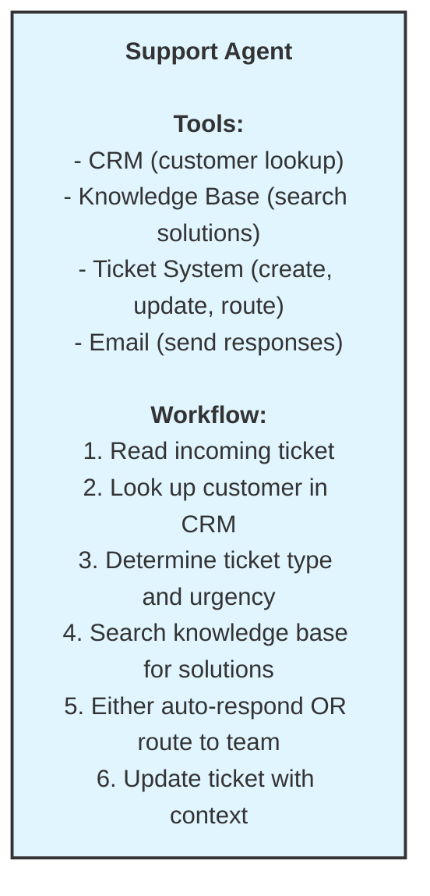
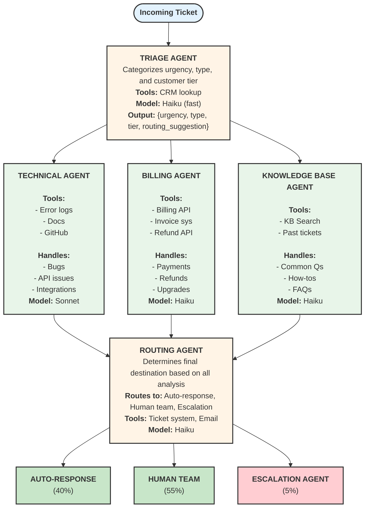
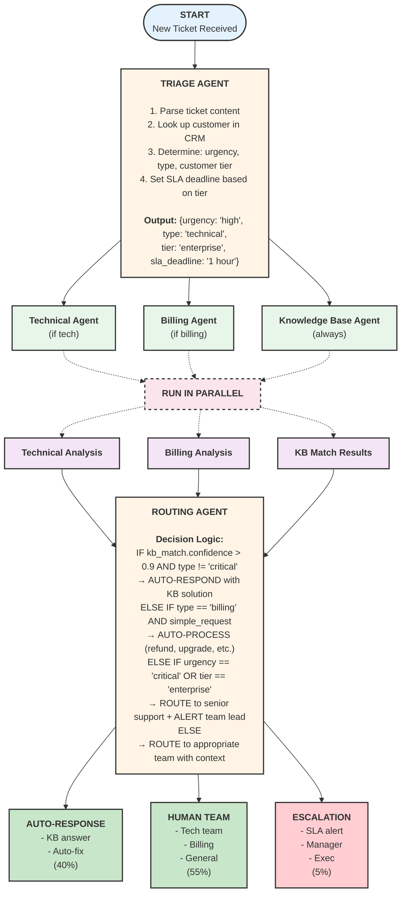
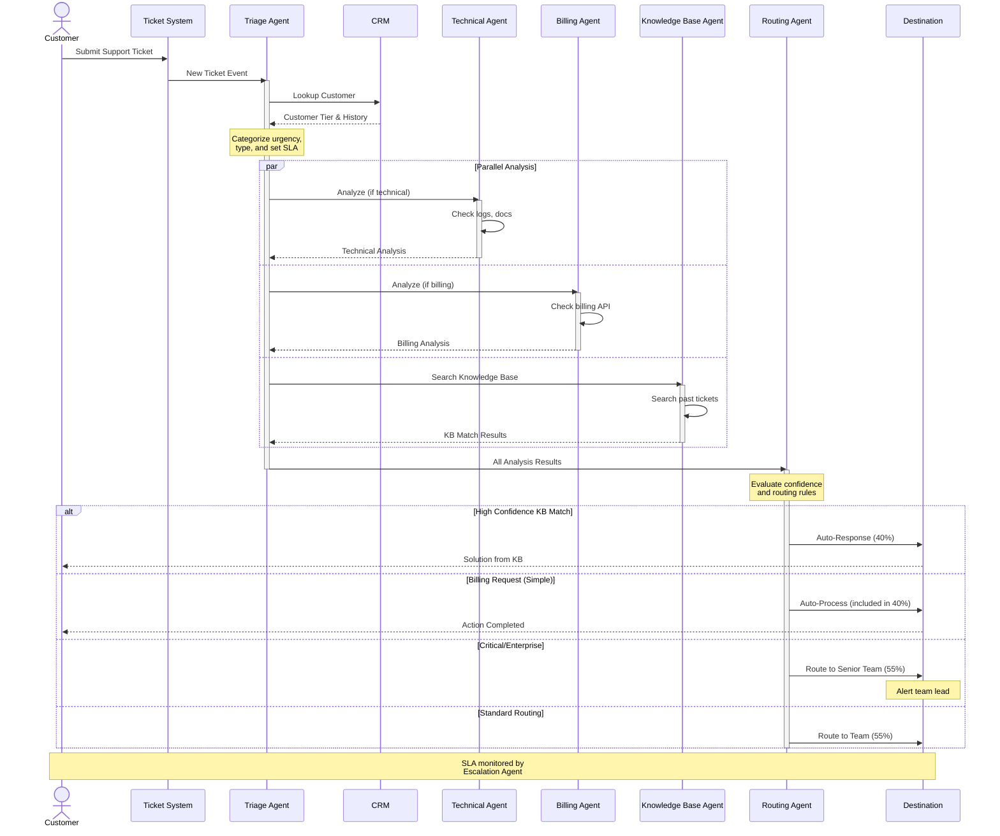
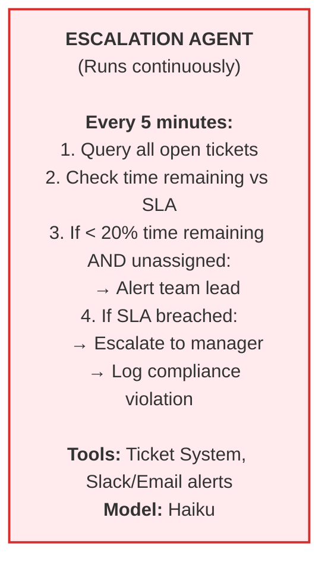

# Customer Support Ticket Routing System Architecture

Design a multi-agent system for intelligent customer support ticket handling.

## Problem Statement

Your SaaS company receives 5,000+ support tickets daily across email, chat, and web forms. Current process:
- All tickets go to L1 support
- Manual categorization and routing
- Average response time: 4 hours
- Enterprise SLA: 1 hour (frequently missed)

**Goal**: Intelligent system that automatically triages, routes, and resolves tickets.

---

## Requirements Analysis

### Functional Requirements
- Triage tickets by urgency and complexity
- Route technical issues to engineering
- Route billing issues to finance
- Prioritize by customer tier (enterprise vs. standard)
- Search knowledge base for similar solved issues
- Auto-respond to common questions
- Escalate unresolved issues to humans with context

### Non-Functional Requirements
- Enterprise SLA: < 1 hour response
- Standard SLA: < 4 hour response
- Handle 5,000+ tickets/day
- 95% routing accuracy
- Audit trail for all decisions

---

## Option A: Single Agent Approach

### Pros
- Simple implementation
- Single context (all info in one place)
- Easy to debug

### Cons
- Sequential processing (slow)
- Can't handle parallel tickets efficiently
- One agent doing too many things
- Hard to specialize for different ticket types

### Estimated Performance
- Processing time: 30-60 seconds per ticket
- Daily capacity: ~2,500 tickets (with queuing)
- SLA compliance: ~70%

---

## Option B: Multi-Agent Approach (Recommended)

### Agent Definitions

| Agent | Responsibility | Tools | Model | Parallel? |
|-------|---------------|-------|-------|-----------|
| Triage | Categorize urgency, type, tier | CRM | Haiku | Entry point |
| Technical | Analyze technical issues | Logs, Docs, GitHub | Sonnet | Yes |
| Billing | Handle payment/account issues | Billing API | Haiku | Yes |
| Knowledge Base | Search for existing solutions | KB Search | Haiku | Yes |
| Routing | Determine final destination | Ticket System | Haiku | After analysis |
| Escalation | Monitor SLA, escalate critical | Alerts | Haiku | Background |

---

## Workflow Diagram

### Sequence Diagram

The following sequence diagram shows the interaction timeline for ticket processing:

---

## SLA Monitoring (Background)

---

## Failure Mode Analysis

| Failure | Impact | Mitigation |
|---------|--------|------------|
| Triage Agent down | All tickets queued | Fallback to round-robin routing |
| Technical Agent slow | Tech tickets delayed | Timeout + route to human |
| KB search fails | No auto-responses | Route all to human (degraded mode) |
| CRM unavailable | Can't identify enterprise | Treat all as enterprise (safer) |
| SLA Agent crashes | Missed escalations | Dead-man switch alerts |

---

## Recommendation

**Choose Option B (Multi-Agent)** because:

1. **Volume**: 5,000+ tickets/day requires parallel processing
2. **Speed**: Enterprise SLA (1 hour) needs fast triage
3. **Specialization**: Technical vs billing needs different expertise
4. **Scalability**: Easy to add new agent types (e.g., Sales Agent)

### Estimated Performance
- Processing time: 5-10 seconds per ticket (parallel)
- Daily capacity: 50,000+ tickets
- Auto-resolution rate: 40%
- SLA compliance: 98%+

---

## Key Takeaways

1. **High-volume systems need parallelization**
   - Single agent can't scale to 5000+ tickets/day

2. **SLA requirements drive architecture**
   - 1-hour enterprise SLA needs fast routing
   - Background monitoring for escalations

3. **Specialization improves quality**
   - Technical agent knows error logs
   - Billing agent knows refund policies

4. **Design for failure**
   - Fallback paths for every agent
   - Graceful degradation, not total failure
