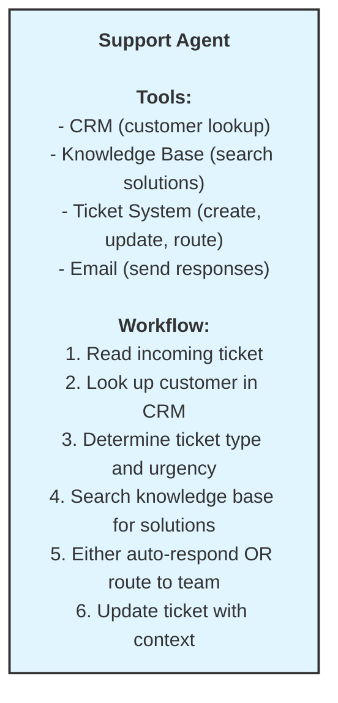

# Customer Support Ticket Routing System Architecture

Design a multi-agent system for intelligent customer support ticket handling.

## Problem Statement

Your SaaS company receives 5,000+ support tickets daily across email, chat, and web forms. Current process:
- All tickets go to L1 support
- Manual categorization and routing
- Average response time: 4 hours
- Enterprise SLA: 1 hour (frequently missed)

**Goal**: Intelligent system that automatically triages, routes, and resolves tickets.

---

## Requirements Analysis

### Functional Requirements
- Triage tickets by urgency and complexity
- Route technical issues to engineering
- Route billing issues to finance
- Prioritize by customer tier (enterprise vs. standard)
- Search knowledge base for similar solved issues
- Auto-respond to common questions
- Escalate unresolved issues to humans with context

### Non-Functional Requirements
- Enterprise SLA: < 1 hour response
- Standard SLA: < 4 hour response
- Handle 5,000+ tickets/day
- 95% routing accuracy
- Audit trail for all decisions

---

## Option A: Single Agent Approach



### Pros
- Simple implementation
- Single context (all info in one place)
- Easy to debug

### Cons
- Sequential processing (slow)
- Can't handle parallel tickets efficiently
- One agent doing too many things
- Hard to specialize for different ticket types

### Estimated Performance
- Processing time: 30-60 seconds per ticket
- Daily capacity: ~2,500 tickets (with queuing)
- SLA compliance: ~70%

---

## Option B: Multi-Agent Approach (Recommended)

<!-- TODO: Design your multi-agent architecture here -->

<!--
INSTRUCTIONS:
1. Design 4-6 specialized agents (Triage, Technical, Billing, Knowledge Base, Routing, Escalation)
2. Create a Mermaid diagram showing:
   - All agents and their relationships
   - Incoming ticket flow
   - Parallel execution paths
   - Final destinations (auto-response, human team, escalation)
3. Use the demo ARCHITECTURE.md as reference for Mermaid syntax
4. Use different colors for different agent types (see demo for style examples)
-->

```mermaid
graph TB
    %% TODO: Create your system architecture diagram here
    %% Start with: Ticket(["Incoming Ticket"])
    %% Then add: Triage agent, specialized agents, routing agent, destinations
    %% Example structure:
    %% Ticket --> TriageAgent
    %% TriageAgent --> TechnicalAgent
    %% TriageAgent --> BillingAgent
    %% TriageAgent --> KBAgent
    %% etc.
```

### Agent Definitions

<!-- TODO: Complete this table with your agent designs -->

| Agent | Responsibility | Tools | Model | Parallel? |
|-------|---------------|-------|-------|-----------|
| TODO | TODO | TODO | TODO | TODO |
| TODO | TODO | TODO | TODO | TODO |
| TODO | TODO | TODO | TODO | TODO |
| TODO | TODO | TODO | TODO | TODO |

<!--
HINTS:
- Triage Agent: Entry point, categorizes tickets, looks up customer
- Technical Agent: Analyzes technical issues if ticket is tech-related
- Billing Agent: Handles payment/account issues if billing-related
- Knowledge Base Agent: Always runs, searches for existing solutions
- Routing Agent: Makes final routing decision based on all analysis
- Escalation Agent: Optional background agent for SLA monitoring
-->

### Pros

<!-- TODO: List advantages of multi-agent approach -->

### Cons

<!-- TODO: List disadvantages of multi-agent approach -->

### Estimated Performance

<!-- TODO: Provide performance estimates -->
<!-- Consider: processing time, daily capacity, SLA compliance -->

---

## Workflow Diagram

<!-- TODO: Create a detailed workflow diagram showing ticket flow from start to finish -->

<!--
INSTRUCTIONS:
1. Use Mermaid flowchart syntax
2. Show the complete ticket journey:
   - START: New ticket received
   - TRIAGE: Agent categorizes and looks up customer
   - PARALLEL: Multiple agents analyze simultaneously
   - ROUTING: Decision logic for final destination
   - DESTINATIONS: Auto-response, human team, escalation
3. Include decision points (alt/else conditions)
4. Use notes to explain key steps
5. Refer to the demo's workflow diagram for structure
-->

```mermaid
flowchart TD
    %% TODO: Create your workflow diagram here
    %% Start with: Start(["START<br/>New Ticket Received"])
    %% Then add each processing step in sequence
    %% Show parallel execution using multiple paths
    %% Add decision points for routing logic
```

### Sequence Diagram

<!-- TODO: Create a sequence diagram showing the interaction timeline -->

<!--
INSTRUCTIONS:
1. Use Mermaid sequenceDiagram syntax
2. Show actors and participants:
   - actor Customer
   - participant System (Ticket System)
   - participant Triage Agent
   - participant CRM
   - participant specialized agents (Tech, Billing, KB)
   - participant Routing Agent
   - participant Destination
3. Show parallel execution using 'par' blocks
4. Use 'activate' and 'deactivate' to show when agents are working
5. Use 'alt' and 'else' for conditional routing
6. Refer to the demo's sequence diagram for examples
-->

```mermaid
sequenceDiagram
    %% TODO: Create your sequence diagram here
    %% Example structure:
    %% actor Customer
    %% participant System as Ticket System
    %% participant Triage as Triage Agent
    %%
    %% Customer->>System: Submit Support Ticket
    %% System->>Triage: New Ticket Event
    %% activate Triage
    %% ... continue the sequence
```

---

## SLA Monitoring (Background)

<!-- TODO: Design the escalation agent for SLA monitoring -->

<!--
INSTRUCTIONS:
1. Create a Mermaid diagram showing the escalation agent
2. Define:
   - How often it runs (e.g., every 5 minutes)
   - What it checks (open tickets, time remaining vs SLA)
   - What triggers escalation (e.g., < 20% time remaining)
   - What actions it takes (alert team lead, escalate to manager)
3. List the tools it needs (Ticket System, Slack/Email alerts)
4. Choose the model (Haiku for fast, simple checks)
-->

```mermaid
graph TB
    %% TODO: Create your SLA monitoring diagram here
```

---

## Failure Mode Analysis

<!-- TODO: Complete the failure mode analysis table -->

| Failure | Impact | Mitigation |
|---------|--------|------------|
| TODO | TODO | TODO |
| TODO | TODO | TODO |
| TODO | TODO | TODO |
| TODO | TODO | TODO |
| TODO | TODO | TODO |

<!--
HINTS - Consider these failure scenarios:
- Triage Agent down
- Technical Agent slow/timeout
- Knowledge Base search fails
- CRM unavailable
- Escalation Agent crashes
- Network issues
- API rate limits

For each, think about:
- IMPACT: What breaks? What's delayed?
- MITIGATION: Fallback strategy, degraded mode, alerts
-->

---

## Recommendation

<!-- TODO: Choose Option A or Option B and justify your decision -->

**Choose Option [A or B] because:**

<!-- TODO: Provide 3-5 reasons based on:
- Volume requirements (5,000+ tickets/day)
- Speed requirements (1-hour enterprise SLA)
- Specialization needs (technical vs billing expertise)
- Scalability (easy to add new agent types?)
- Cost vs benefit trade-offs
-->

### Estimated Performance

<!-- TODO: Provide specific performance estimates for your chosen approach -->

- Processing time: TODO seconds per ticket
- Daily capacity: TODO tickets
- Auto-resolution rate: TODO%
- SLA compliance: TODO%

---

## Key Takeaways

<!-- TODO: Write 3-4 key learnings from this architecture exercise -->

1. **TODO** - Your first key takeaway

2. **TODO** - Your second key takeaway

3. **TODO** - Your third key takeaway

4. **TODO** - Your fourth key takeaway (optional)
